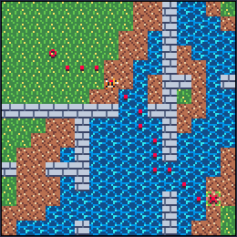
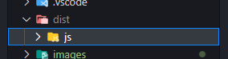
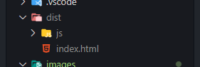

# Path Finding
 

This is a project for studying algorithms and a bit of game design.

## Running

To run this project you need to have node, npm or yarn installed.

Just download the code or clone the repo in the desired folder then on the **project folder** run `npm install` to install all the dependencies.

A _node_modules_ folder should appear, after that run `npm run build` to build the project.

After building a _dist_ folder with a _js_ folder inside will appear in the project folder.



Now create a new `html` file inside the _dist_ folder.



Then paste this code inside the **body tag**.

```html
<canvas></canvas>
<p>mouse x: 0 mouse y: 0</p>
<script src="./js/index.js"></script>
```
You will need a server to run the html code, I recommend using the [live server](https://marketplace.visualstudio.com/items?itemName=ritwickdey.LiveServer) vscode extension.

## Built With
- [TypeScript](https://www.typescriptlang.org/) - Main programming language.
- [Webpack](https://webpack.js.org/) - Building the project.
- [LibreSprite](https://libresprite.github.io/) - Creation and edition of the image assests.


## Acknowledgments

The implementation of the path finding algorithm was based on the [red blob games](https://www.redblobgames.com/pathfinding/a-star/introduction.html) implementation.
